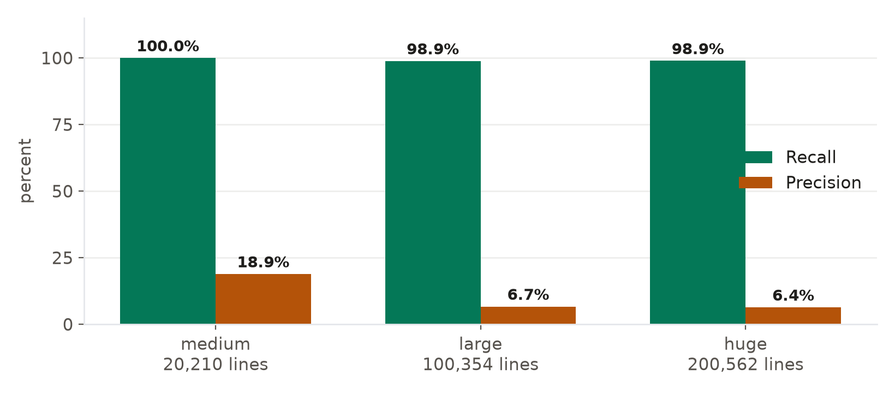
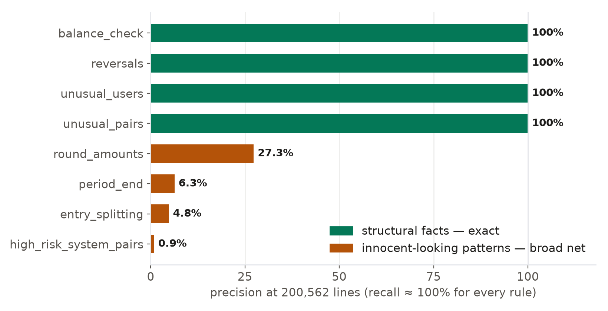
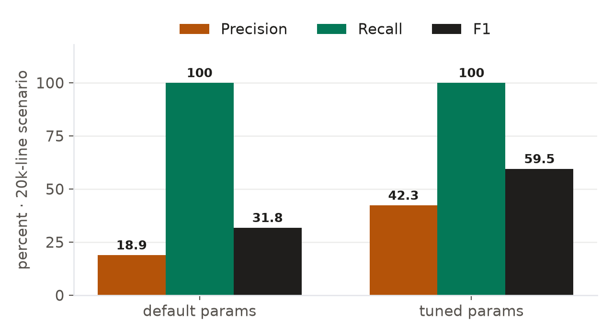

.docname Rapport de projet JE Agent
.docauthor Salah Eddine
.doctype paged
.theme paper

# Test des écritures de journal, tranché.

### JE Agent, un assistant d'audit assisté par IA pour les écritures de journal (ISA 240 / AS 2401)

Ce rapport présente JE Agent, un outil logiciel qui assiste les auditeurs dans le test des écritures de journal selon ISA 240 et AS 2401. Il décrit le problème auquel l'outil répond, la logique de son architecture et les résultats d'une évaluation contrôlée sur des populations allant jusqu'à 200 000 lignes. Ce document s'adresse à un lecteur non technique ; le détail d'implémentation figure dans la documentation du dépôt (`DESIGN.md`, `PROJECT_REPORT.md`).

# Sommaire

1. **Le problème** : les limites de la pratique actuelle
2. **La logique** : une architecture à trois couches
3. **La console** : l'environnement de travail
4. **Évaluation** : un test de charge contrôlé
5. **Confiance et intégrité** : les garanties de la piste d'audit
6. **Limites**
7. **Conclusion**
- Annexe A · Les dix règles en langage courant
- Annexe B · Exécution par vous-même
- Glossaire

# 1 · Le problème

ISA 240 et AS 2401 exigent de l'auditeur qu'il examine les écritures de journal afin de détecter tout indice de contournement des contrôles par la direction. En pratique, cet examen se heurte à un problème d'échelle. Un export annuel complet contient couramment des dizaines voire des centaines de milliers d'écritures, parmi lesquelles les écritures réellement significatives ne représentent qu'une faible proportion.

La pratique actuelle emprunte trois voies, chacune présentant une faiblesse connue.

La revue manuelle ne passe pas à l'échelle. Lire un grand livre complet n'est pas réaliste ; le travail est donc effectué par échantillonnage. Les écritures hors échantillon ne sont jamais examinées, et la couverture réellement obtenue est difficile à établir.

Les filtres scriptés passent à l'échelle mais produisent du bruit. Un critère tel que « montants ronds au-delà d'un seuil » renvoie de grands ensembles dominés par des écritures légitimes : les factures commerciales sont fréquemment rondes, et une comptabilisation en fin de période relève de la pratique ordinaire. L'effort du réviseur se consomme à écarter des faux positifs, et la qualité effective du filtrage demeure inconnue.

L'analyse par IA seule introduit un déficit de responsabilité. Un modèle de langage peut classer des écritures, mais il ne peut pas étayer sa production au standard requis pour constituer des éléments probants, et ses conclusions ne peuvent être défendues lors d'une revue de dossier sans raisonnement traçable.

Ces faiblesses sont complémentaires plutôt que cumulatives. La revue manuelle apporte le jugement à faible volume, les scripts apportent la couverture sans jugement, et les modèles apportent la priorisation sans responsabilité. JE Agent tente de combiner les trois afin que chacun n'opère que là où il est fiable.

# 2 · La logique, trois couches

!(580x420)[La couverture de connexion de la console](assets/audit_login.png)

JE Agent traite un export comptable à travers trois couches successives.

!(580x165)[Pipeline à trois couches](assets/diagram_layers.png)

**Couche 1, règles déterministes.** Dix contrôles transparents examinent chaque écriture : montants ronds, découpage d'écritures, comptabilisation en fin de période, déséquilibres, utilisateurs rares, combinaisons de comptes inhabituelles, contre-passations, divergence de dates, utilisateurs à risque, concentration d'écritures manuelles. Chaque contrôle est une condition lisible et inspectable qui indique pourquoi elle s'est déclenchée. Les règles assurent une couverture complète des schémas qu'elles encodent, mais elles signalent aussi de nombreuses écritures légitimes partageant des caractéristiques de surface avec des indicateurs de risque. Leur rôle est le filtrage, pas la conclusion.

**Couche 2, triage par IA.** Un modèle de langage classe les écritures signalées selon leur pertinence probable et produit pour chaque classement une courte justification écrite. Sa production est enregistrée comme conseil généré par machine et ne porte aucune autorité de décision. Cette couche réduit l'ordre dans lequel un humain examine le contenu ; elle ne réduit pas la responsabilité humaine sur ce qui est décidé.

**Couche 3, jugement humain.** Chaque écriture parvenue en revue exige une décision explicite de l'auditeur, examiner ou accepter, appuyée par une justification écrite obligatoire. Les décisions sont enregistrées dans une chaîne de hachage : chaque enregistrement contient l'empreinte de son prédécesseur, si bien que toute modification ultérieure de la piste devient détectable.

À l'achèvement, le pipeline produit les livrables du dossier : un rapport en PDF (anglais ou français), un papier de travail Excel et la liste des écritures signalées.

# 3 · La console

JE Agent s'exécute localement. Les données du dossier restent sur la machine hôte ; seuls les appels de triage optionnels en sortent, et ils fonctionnent en mode sans conservation.

!(580x420)[Tableau de bord, vue des engagements](assets/audit_dash.png)

Le tableau de bord liste chaque engagement avec sa population, sa phase et son statut.

!(580x420)[Surveillance, résultats des règles et événements d'audit](assets/audit_monitor.png)

La surveillance affiche les compteurs par règle et la chronologie des événements du pipeline pour l'exécution sélectionnée.

!(580x420)[Revue, le registre](assets/audit_review.png)

La file de revue présente les écritures classées avec les règles déclenchées. Sélectionner une écriture ouvre ses lignes de journal. L'enregistrement d'une décision demande une action plus une raison écrite.

!(580x420)[Rapport, livrables et analyses](assets/audit_report.png)

La page Rapport rassemble les livrables, résume les décisions et compare les fréquences des premiers chiffres à la référence de Benford, à titre indicatif uniquement.

!(580x420)[Nouvel engagement](assets/report_shot_new.png)

Un engagement commence par un dépôt de CSV. La correspondance des colonnes est détectée automatiquement ; le seuil de signification, le mode de revue et la langue du rapport se règlent dans un seul formulaire.

!(580x420)[Interface française](assets/report_shot_fr.png)

L'interface et le rapport généré existent en anglais et en français.

.pagebreak

# 4 · Évaluation

L'objectif de l'évaluation était de mesurer la performance de détection face à une vérité terrain connue. Les grands livres réels ne sont pas étiquetés ; l'évaluation a donc utilisé des populations synthétiques dans lesquelles des anomalies étaient injectées délibérément. Chaque anomalie injectée porte une étiquette nommant la règle censée la détecter, ce qui permet de calculer exactement rappel et précision.

## Méthodologie

Trois populations ont été générées, de 20 210 à 200 562 lignes, chacune déterministe sous sa graine aléatoire. La base propre a été construite pour ressembler à des données opérationnelles plutôt qu'à des données idéalisées : environ 90 % d'écritures manuelles et 10 % d'écritures système, des utilisateurs à activité légitimement faible, de grandes factures légitimes et des comptabilisations en début de mois. Ce bruit compte : il permet aux faux positifs de se produire, et donc d'être comptés.

Pour chaque règle, le rappel est la part des anomalies injectées détectées, et la précision est la part des signalements correspondant à une anomalie injectée. Les signalements portés sur des documents propres comptent comme faux positifs.

## Résultats par échelle

| Scénario | Lignes | Injectées | Rappel | Précision |
|---|---|---|---|---|
| medium | 20 210 | 105 | **100 %** | 18,9 % |
| large | 100 354 | 177 | **98,9 %** | 6,7 % |
| huge | 200 562 | 281 | **98,9 %** | 6,4 % |



Le rappel reste à ou près de 100 % à chaque échelle : presque aucune anomalie injectée n'échappe à la détection, et la plus grande population s'ingère en une quatorzaine de secondes. La précision diminue quand la population croît, car la fréquence des écritures bénignes ressemblant à des indicateurs de risque croît avec elle, alors que les anomalies véritables restent rares par nature. Les deux observations découlent de l'intention de conception : la couche un filtre complètement et accepte le bruit en échange.

## Résultats par règle (scénario 200k lignes)

| Règle | Rappel | Précision |
|---|---|---|
| round_amounts | 100 % | 27 % |
| entry_splitting | 100 % | 5 % |
| period_end | 100 % | 6 % |
| unusual_pairs | 96 % | 100 % |
| unusual_users | 100 % | 100 % |
| balance_check | 100 % | 100 % |
| reversals | 100 % | 100 % |
| date_divergence | 87 % | 100 % |
| high_risk_system_pairs | 100 % | 0,9 % |



Les résultats se séparent en deux groupes. Les règles définies sur des faits structurels (déséquilibres, véritables paires de contre-passation, utilisateurs sans historique, paires de comptes absentes de la référence) atteignent une précision quasi parfaite, car ces faits n'ont pas d'explication innocente courante. Les règles définies sur des tendances statistiques (arrondi, calendrier, granularité) conservent un rappel complet mais une précision en baisse, puisque des écritures légitimes partagent ces caractéristiques. Cette distinction informe le poids à accorder à la production de chaque règle en revue.

## Ciblage de l'univers

Le réviseur voit une sélection plafonnée et classée (l'univers), restreinte aux écritures au-dessus du seuil de signification opérationnel. Entre 97 % et 100 % des anomalies injectées au-dessus du seuil ont atteint l'univers lors des tests. L'exclusion sous le seuil fonctionne comme spécifié.

## Sensibilité des paramètres

Les seuils ont été traités comme des hypothèses configurables plutôt que comme des constantes. Sur le scénario medium, deux paramètres ont été ajustés (une fenêtre de fin de période plus étroite et un seuil de rareté plus strict pour les comptes système) et l'exécution répétée.

| Métrique | Par défaut | Ajusté |
|---|---|---|
| Précision globale | 18,9 % | **42,3 %** |
| Rappel global | 100 % | **100 %** |



La précision a été multipliée par 2,2 sans perte de rappel. La leçon générale importe plus que les chiffres : les seuils interagissent avec la composition de la population à laquelle ils font face, et doivent donc être calibrés selon le seuil de signification propre à chaque engagement. Le harnais rend cet étalonnage mesurable.

## Couche de triage

Le modèle de triage a été évalué séparément sur le plus petit scénario. Il a identifié 100 % des anomalies injectées, avec une précision d'examen d'environ 41 %. Le modèle remplit donc sa fonction prévue : une priorisation large devant la revue humaine. La précision est obtenue par le réviseur, non par le modèle, conformément à la répartition des responsabilités décrite en section 2.

# 5 · Confiance et intégrité

Quatre mécanismes protègent l'intégrité des papiers de travail.

**Décisions chaînées par hachage.** Chaque enregistrement de décision inclut l'empreinte de l'enregistrement précédent. Toute modification d'une entrée historique rompt la chaîne et devient détectable.

**Portes de citation.** Le narratif généré ne peut être finalisé tant que chaque affirmation factuelle ne cite pas des données présentes dans l'exécution.

**Cœur déterministe.** Une entrée identique produit des signalements identiques, permettant de reproduire les résultats à toute date ultérieure.

**Finalisation humaine exclusive.** Quatre portes d'achèvement (couverture de revue, procédures documentées, citations valides, limites énoncées) doivent être franchies avant finalisation. La finalisation ne peut intervenir sans décisions humaines enregistrées.

# 6 · Limites

Les limites suivantes ont été observées directement durant l'évaluation.

La précision globale à grande échelle est faible par construction : 6,4 % à 200k lignes. La couche de règles privilégie volontairement l'exhaustivité plutôt que la sélectivité, et la charge de travail du réviseur reflète ce choix. L'utilisateur doit s'attendre à passer en revue des signalements, non à recevoir des verdicts.

`high_risk_system_pairs` dépend de la configuration. Les utilisateurs à risque doivent être déclarés pour que la règle soit significative ; en l'absence de configuration, elle a mesuré 0,9 % de précision.

`date_divergence` a manqué environ 13 % des injections dont les dates de document falsifiées tombaient dans la fenêtre acceptée.

Les populations d'évaluation, bien que texturées pour ressembler à des données opérationnelles, restent synthétiques. Le comportement sur des données clients réelles différera de façons que le harnais ne peut pas anticiper entièrement.

# 7 · Conclusion

JE Agent combine filtrage déterministe, priorisation assistée par IA et jugement humain obligatoire pour le test des écritures de journal selon ISA 240 / AS 2401. L'évaluation appuie trois conclusions. La détection des classes d'anomalies injectées est quasi complète et passe à l'échelle de 200 000 lignes en quelques secondes. L'architecture conforte l'autorité finale exclusivement à l'auditeur réviseur. Et les limites du système ont été mesurées et publiées à côté de ses forces, ce qui est précisément la norme que sa propre piste d'audit est conçue pour faire respecter.

.pagebreak

# Annexe A · Les dix règles en langage courant

| # | Règle | Ce qu'elle cherche | Pourquoi c'est important |
|---|---|---|---|
| 1 | manual_entries | écritures saisies à la main plutôt que postées par un système | les écritures manuelles concentrent le risque de contournement |
| 2 | round_amounts | montants sur des nombres suspects de ronds (10 000 / 100 000…) | les chiffres inventés sont rarement précis |
| 3 | entry_splitting | une obligation découpée en morceaux juste sous les seuils d'approbation | moyen classique d'esquiver une seconde signature |
| 4 | period_end | écritures comptabilisées autour de la clôture | la pression de clôture est le moment où les chiffres sont « arrangés » |
| 5 | unusual_pairs | combinaisons de comptes rarement observées ensemble | ex. revenu débité contre un compte d'actif |
| 6 | unusual_users | identifiants presque sans historique agissant seuls | des identifiants fantômes ou prêtés ne laissent guère de traces |
| 7 | balance_check | documents dont débits et crédits ne s'équilibrent pas | des écritures déséquilibrées signalent des contrôles défaillants |
| 8 | reversals | une écriture contre-passée peu après, même montant | contrepasser après bénéfice = possible dissimulation |
| 9 | date_divergence | date de document loin de la date de comptabilisation | l'antidatage déplace les opérations vers de mauvaises périodes |
| 10 | high_risk_system_pairs | utilisateurs à risque configurés combinés à des comptes inhabituels | les utilisateurs privilégiés exigent une attention partout où ils interviennent |

Chaque règle est un contrôle transparent et inspectable. Aucune boîte noire n'opère à cette couche.

# Annexe B · Exécution par vous-même

JE Agent s'exécute entièrement sur votre machine. Trois commandes depuis un clone neuf :

```bash
git clone https://github.com/salaheddine-11/je-agent && cd je-agent
uv sync
uv run jeagent serve
```

Ouvrez ensuite `http://localhost:8300` dans un navigateur (clé par défaut : `jeagent`).

**Un engagement type demande environ cinq minutes d'attention :**

1. **Nouvel engagement** : déposez votre export CSV ; la correspondance des colonnes est détectée automatiquement. Réglez le seuil global/opérationnel, choisissez le mode de revue humain ou assisté par IA, choisissez la langue du rapport.
2. **Surveillance** : observez les étapes du pipeline se vérifier elles-mêmes : ingestion → règles → recoupement → triage.
3. **Revue** : parcourez le registre. Chaque écriture montre les règles déclenchées et ses lignes de journal complètes ; chaque décision demande un clic plus une raison écrite.
4. **Finalisation** : quatre portes vérifient la couverture de revue, les procédures, les citations et les limites ; puis le rapport PDF, le papier de travail Excel et la liste des écritures signalées sont générés.

Prérequis : un système d'exploitation moderne, Python 3.12+, environ 200 Mo d'espace libre. Internet n'est nécessaire que pour les appels de triage IA optionnels (mode sans conservation) ; tout le reste s'exécute localement, si bien que les données clients ne quittent jamais la machine.

# Glossaire

**Écriture de journal (JE)** : l'enregistrement élémentaire d'une transaction comptable : des lignes datées, chacune crédit ou débit d'un compte.

**ISA 240 / AS 2401** : normes internationale (IAASB) et américaine (PCAOB) exigeant des auditeurs qu'ils traitent le risque de fraude, y compris explicitement le test des écritures de journal.

**Seuil de signification** : le niveau au-delà duquel les inexactitudes comptent pour les états financiers. JE Agent distingue le seuil *global* et le seuil *opérationnel* (le seuil de travail pour les tests).

**Seuil de signification opérationnel (PM)** : voir ci-dessus ; les écritures au-dessus du PM déterminent la portée de l'univers de revue.

**Univers** : la sélection classée d'écritures signalées que le réviseur voit réellement, ciblée sur les écritures au-dessus du seuil opérationnel et plafonnée pour une revue praticable.

**Rappel** : parmi toutes les anomalies vraies présentes, la part captée par le système. Manquer une fraude est l'erreur coûteuse, donc le rappel est la métrique titre.

**Précision** : parmi tout ce que le système a signalé, la part véritablement anormale. Une précision faible signifie du bruit que le réviseur doit trier.

**F1** : la moyenne harmonique du rappel et de la précision.

**Loi de Benford** : les données naturelles suivent des fréquences de premier chiffre prévisibles (1 est bien plus fréquent que 9). Les nombres fabriqués s'écartent de ce schéma ; JE Agent présente la comparaison uniquement à titre indicatif.

**Chaîne de hachage** : chaque enregistrement de décision porte l'empreinte cryptographique du précédent ; altérer l'historique rompt la chaîne et devient détectable.

**Sans conservation** : appels IA configurés pour que le fournisseur ne conserve rien du contenu des requêtes.
